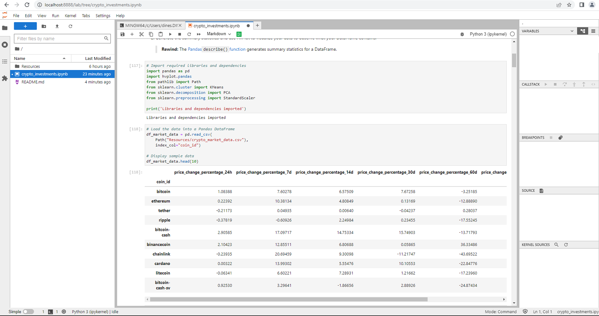
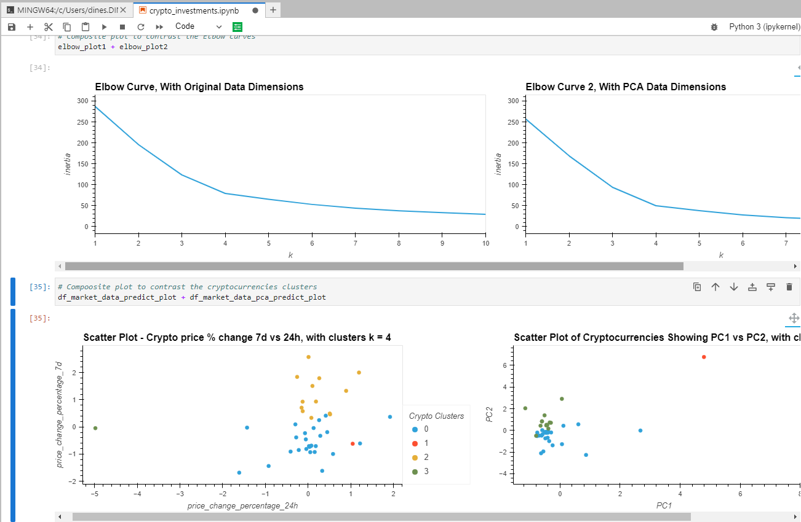

# Crypto Portfolio Analyzer
Crypto Portfolio Analyzer is a Jupyter Notebook based application prototype which clusters cryptocurrencies by their performance in different time periods using a Machine Learning algorithm (Clustering, K-means). [Clustering](https://scikit-learn.org/stable/modules/clustering.html#) is an unsupervised machine learning algorithm.

In the Jupyter Notebook, you may see the following key steps performed that are usually accomplished to explain about clusters.

* Import the Data from a CSV file
* Prepare the Data
* Find the Best Value for k Using the Original Data
* Cluster Cryptocurrencies with K-means Using the Original Data
* Optimize Clusters with Principal Component Analysis
* Find the Best Value for k Using the PCA Data
* Cluster the Cryptocurrencies with K-means Using the PCA Data
* Visualize and Compare the Results

---

## Technologies

This project leverages python 3.7.* with the following additional packages:
* [Jupyter Notebook](https://jupyter.org/) - The Crypto Portfolio Analyzer is written in the Jupyter Notebook.
* [Conda](https://docs.conda.io/projects/conda/en/latest/) - Conda environment is recommended to have Pandas library and other dependencies pre-installed.

**Required Libraries:**

You may need the following libraries to work with the program.

- [Pandas](https://pandas.pydata.org/docs/reference/index.html) - pandas is a Python package providing fast, flexible, and expressive data structures designed to make working with “relational” or “labeled” data both easy and intuitive.
- [hvPlot](https://hvplot.holoviz.org/) - hvPlot provides a high-level plotting API built on HoloViews that provides a general and consistent API for plotting data in Python.
- [scikit-learn](https://scikit-learn.org/stable/getting_started.html/) - Scikit-learn is an open source machine learning library that supports supervised and unsupervised learning.
---

## Usage

To use the Crypto Portfolio Analyzer application, clone the repository and run the **crypto_investments.ipynb** with Jupyter notebook.

From the Git Bash terminal, make sure to 'activate conda' and appropriate virtual enivorment. Next, launch the JupyterLab web-based interactive development environment (IDE) interface by typing at the prompt:

```python
  > jupyter lab
```

Then, browse to **crypto_investments.ipynb** starter code file to run the program. See the image below for a quick hint.



You may see hvplots and elbow curves of the clusters when plotted using the original vs the PCA data.



## Contributors

FinTech Labs, Inc.

---

## License

None